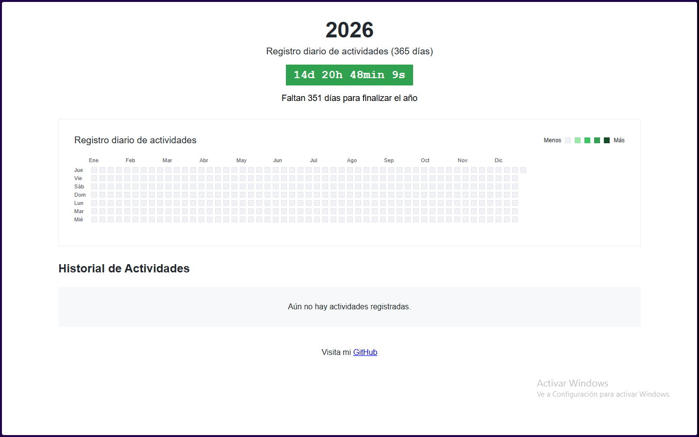

## Registro de actividades de 2026

(365 días, con 54 semanas, con 12 meses)

---

### Enero

- 1 de enero: Año Nuevo
- 6 de enero: Día de Reyes

### Febrero

-
-
-

### Marzo

-
-
-

### Abril

-
-
-

### Mayo

-
-
-

### Junio

-
-
- 28 de junio: Cumpleaños de LeoBringasAtLife [Leonardo Bringas] [GitHub](https://github.com/leobringasatlife) (yo)

### Julio

-
-
-

### Agosto

-
-
-

### Septiembre

-
-
-

### Octubre

-
-
-

### Noviembre

-
-
-

### Diciembre

- 25 de diciembre: Navidad
- 31 de diciembre: Nochevieja

---

_Este archivo se actualizará a lo largo del año con nuevas actividades y eventos importantes._
